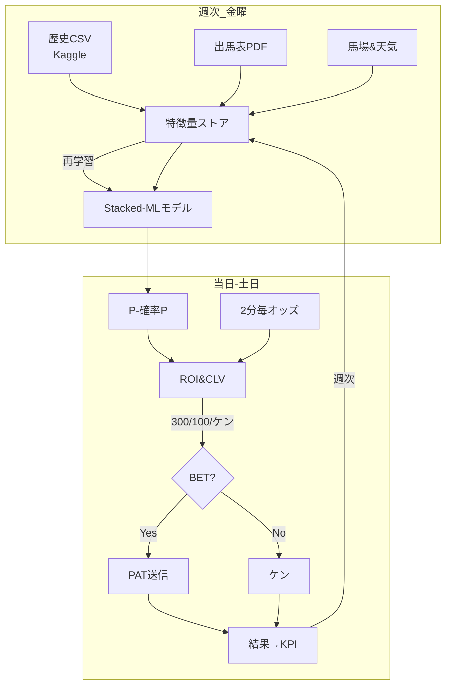

# 1. ガイドライン（目的・全体像・成功基準）



| 項目 | ゴール値 | 用語簡説 |
|------|----------|---------|
| 年間回収率 | **≥110 %** | (*払戻 ÷ 購入*)×100 |
| MAE (確率誤差) | ≤0.05 | 0=完璧 |
| CLV平均 | >0 | 購入時オッズ−締切時オッズ |
| Risk-of-Ruin | ≤5 % | 破産確率 |

*買わない判断を「ケン」と呼ぶ。*  

---

# 2. 実装方法 ― 詳細指示書

## 2-1. ディレクトリ構成

```
keiba110/
 ├─ data/
 │   ├─ raw/            # PDF, HTML, JSON
 │   ├─ processed/      # Parquet
 │   └─ model/          # .pkl 等
 ├─ src/
 │   ├─ 00_fetch/
 │   │    ├─ fetch_entries.py
 │   │    ├─ fetch_ozz.py
 │   │    ├─ fetch_baba.py
 │   │    └─ fetch_weather.py
 │   ├─ 10_feature/
 │   │    └─ build_features.py
 │   ├─ 20_model/
 │   │    └─ train_stack.py
 │   ├─ 30_live/
 │   │    └─ live_bet.py
 │   └─ 40_dashboard/
 │        └─ dashboard.py
 ├─ setup.sh
 └─ cron_jobs.txt
```

## 2-2. 環境セットアップ (`setup.sh` 抜粋)

```bash
pyenv install 3.11.7
pyenv virtualenv 3.11.7 keiba-env
pyenv activate keiba-env
pip install -r requirements.txt
brew install --cask temurin   # PDF 抽出用
```

`requirements.txt` には  
`requests  httpx  pandas  polars  duckdb  pyarrow  beautifulsoup4  lxml  tabula-py  pdfplumber  selenium  chromedriver-binary-auto  lightgbm  xgboost  scikit-learn  shap` を列挙。

## 2-3. 主要スクリプト仕様

| スクリプト | 入力 / 出力 | ポイント |
|-----------|-------------|----------|
| `fetch_entries.py` | rpdf URL → `data/raw/pdf/` | `tabula.read_pdf(area=[108,28,790,566], columns=[28,70…])` |
| `fetch_ozz.py` | netkeiba API → parquet | 2 min ループ。User-Agent付き / 2 req/min 制限 |
| `fetch_baba.py` | JRA 馬場 HTML → parquet | 金曜09:00・当日06:05/11:05 |
| `fetch_weather.py` | JMA JSON → parquet | 3 h every day |
| `build_features.py` | raw → `data/processed/features.parquet` | 相互情報量 <0.01 で列削除 |
| `train_stack.py` | features → `model/*.pkl` | LGBM+XGB+Logit→Isotonic→Stack |
| `live_bet.py` | 最新オッズ+P̂ | ROI/CLV→ステーク計算→Selenium で PAT 送信 |
| `dashboard.py` | DuckDB → Streamlit | KPI＋四象限チャート |

### PAT 送信方法

* デモでは Selenium で A-PAT Web を自動操作。  
* **正式運用は team-nave「JRA-IPAT API」** に置換可  ([team-nave](https://blog.team-nave.com/products/?utm_source=chatgpt.com))。  

> JRA は外部ソフトの動作保証をしていない。利用は自己責任  ([team-nave - 競馬 データベースAPIサービス「HorseRacing ...](https://www.team-nave.com/system/jp/products/kbdbapi/?utm_source=chatgpt.com))。

## 2-4. Cron 登録 (`cron_jobs.txt`)

```
# 金曜
0 9  * * 5  python src/00_fetch/fetch_baba.py
0 23 * * 5  python pipeline_weekly.sh
# 土日
5 6,11 * * 6,7 python src/00_fetch/fetch_baba.py
*/2 7-16 * * 6,7 python src/30_live/live_bet.py
0 17 * * 6,7 python src/40_dashboard/update_kpi.py
```

`pipeline_weekly.sh` は Fetch → Feature → Train を順番実行。

## 2-5. ステーク計算アルゴリズム

```python
EV   = P̂ * odds * 0.8         # 払戻率補正
ROI  = EV - 1
CLV  = odds - odds_close
edge = ROI                     # synonym
k    = 0.25                    # ¼ Kelly
while math.exp(-2*edge**2*bankroll/1.2) > 0.05:
    k /= 2                     # RoR<=5%まで縮小
if ROI >= .30 and CLV > 0:
    stake = max(300, round(bankroll*k*edge/(odds-1)/100)*100)
elif ROI >= .10 and CLV > 0:
    stake = 100
else:
    stake = 0                  # Ken
```

---

# 3. 取得すべきデータリスト

| ID | 名称 | URL パターン / API | 主キー | フィールド例 | 形式 | 更新 |
|----|------|-------------------|-------|-------------|------|------|
| D1 | **歴史レース** | Kaggle `jra-raw-races-*.csv` | `race_id` | date, course, time, lap | CSV | 初回DL |
| D2 | **出馬表** | `https://www.jra.go.jp/keiba/rpdf/{yyyymm}/{dd}/{jjj}.pdf` | `race_id` | horse_id, draw, weight | PDF | 金曜23 |
| D3 | **オッズ** | `https://race.netkeiba.com/api/api_get_jra_odds.html?type=1&race_id={rid}` | `race_id` + 2 min スタンプ | umaban, odds_win, odds_plc | JSON | 2 min |
| D4 | **馬場状態** | `https://www.jra.go.jp/keiba/baba/{yyyymmdd}{jj}.html` | `date,course` | turf_state, dirt_state, moisture | HTML | 金曜/当日 |
| D5 | **クッション値** | 同上 HTML 中テーブル | `date,course` | cushion_val | HTML | 同上 |
| D6 | **気象 3h 予報** | `https://www.jma.go.jp/bosai/forecast/data/forecast/{area}.json` | `datetime,area` | weather, temp, wind | JSON | 3 h |
| D7 | **番組改定 PDF** | JRA「重賞競走変更点」 | `race_name` | dist_change, date_change | PDF | 年次 |
| D8 | **PAT 投票ログ** | Selenium 生成 | txn_id | race_id, stake, result | CSV | 各BET |

---

## 参考文献 / 出典

* PAT 自動送信の注意  ([team-nave - 競馬 データベースAPIサービス「HorseRacing ...](https://www.team-nave.com/system/jp/products/kbdbapi/?utm_source=chatgpt.com))  
* team-nave IPAT-API  ([team-nave](https://blog.team-nave.com/products/?utm_source=chatgpt.com))  

---

### これで準備完了

1. **環境を作る → `setup.sh`**  
2. **金曜に `pipeline_weekly.sh`**  
3. **当日は `live_bet.py` を回す**  
